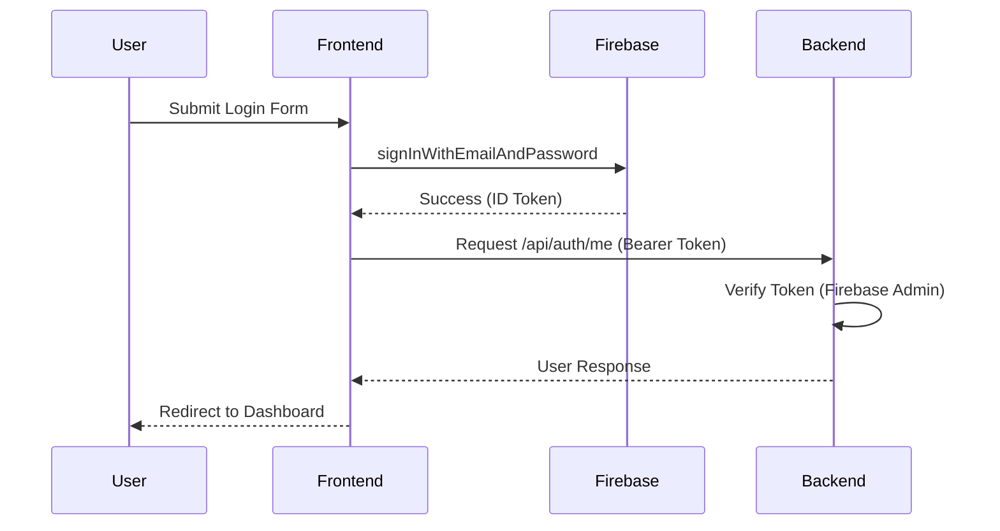

# NENA Authentication Module

This document outlines the principles, technologies, and interaction patterns for the NENA authentication system.

## Principles

1. **Decentralized Management**: User identity is managed primarily via Firebase Authentication, ensuring high security and scalability.
2. **Stateless Backend**: The Python backend remains stateless by verifying Firebase ID Tokens on every protected request.
3. **Hybrid State Management**: Frontend state is managed via React Context (`AuthContext`), syncing with Firebase's `onAuthStateChanged`.
4. **Domain Driven Design**: Auth logic is encapsulated in dedicated components (Routes, Services, Decorators) following the project's DDD structure.

## Technology Stack

- **Backend**: Python (Flask)
- **Frontend**: Next.js (React)
- **Identity Provider**: Firebase Authentication
- **Data Persistence**: Firestore (Simulated in `FirebaseService`)
- **Transport**: JWT (Firebase ID Tokens) via Authorization Header

## How to Interact

### Frontend

- **`useAuth()`**: Use this hook to access the current `user`, `isAuthenticated` status, and auth actions (`login`, `signup`, `logout`).
- **`AuthGuard`**: Wrap protected layouts or pages with this component to enforce authentication and handle redirects.

### Backend

- **`@login_required`**: Apply this decorator to any Flask route that requires an authenticated user. It will automatically verify the token and inject `request.user`.

## Resources and Layout

### Backend Models

The auth module relies on the following simulated Firestore layout:

#### User Profile
- **Collection**: `users`
- **Fields**:
  - `id`: string (Firebase UID)
  - `username`: string (Unique handle)
  - `email`: string
  - `fullName`: string
  - `avatarUrl`: string (Optional)
  - `bio`: string
  - `createdAt`: ISO Timestamp

### Required Services

- **Firebase SDK**: Initialized in `client/src/lib/firebase/config.ts`.
- **Firebase Admin (Simulation)**: Handled in `server-python/services/firebase_service.py`.

## Flow Diagram

